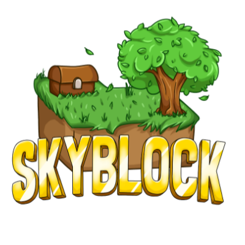

</img>

# A SkyBlock Plugin for PocketMine-MP

## Features

- [x] Unlimited custom islands can be added
- [x] Multi-language support
- [x] User-friendly UI interface
- [x] Island settings
- [x] Island members

## How to Add a World?

1. Make sure you have an active world in PocketMine-MP.
2. Copy the world into the `plugin_data/ASkyBlock/world` directory.
3. Congratulations! You have successfully added the desired island. Players can now create the island you added.

## How to Add Languages?

1. Create a `.yml` file in the `plugin_data/ASkyBlock/language` directory.
2. Copy all the language data into the file and translate it.
3. Change the `language-file` to the name of the language file you just created.
